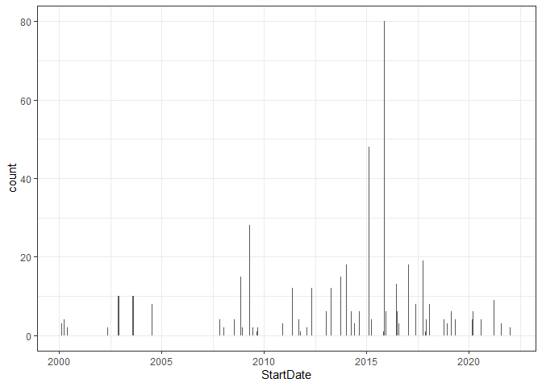
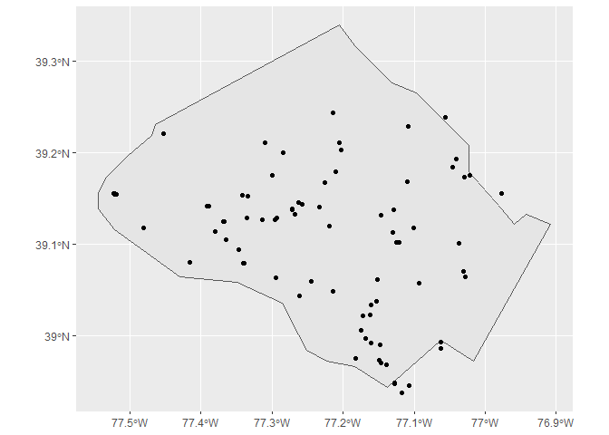
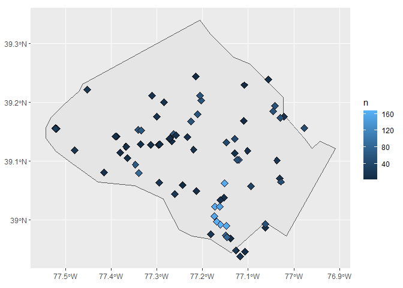
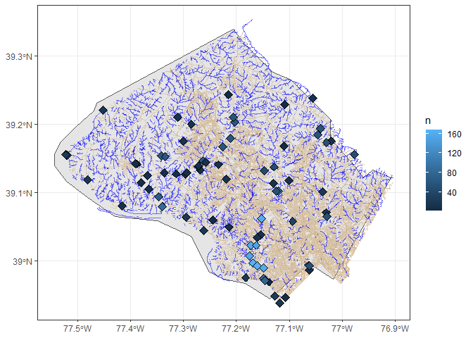
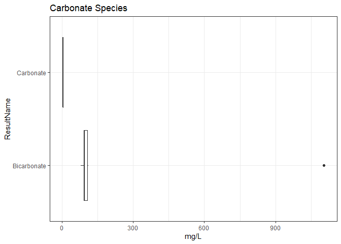
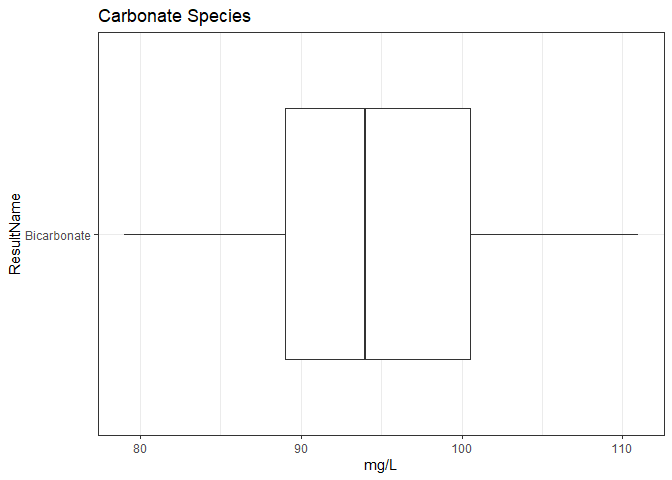
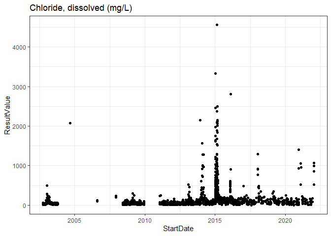
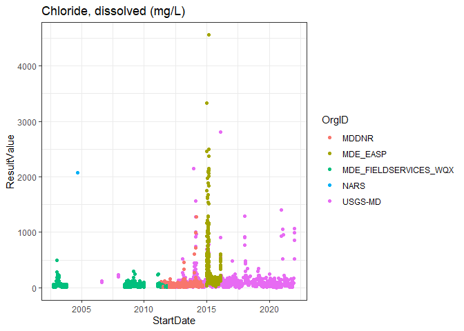

lab1\_2022
================

Code and data available at: <https://github.com/sal2222/env_chem>

## Read-in data

Source: USGS Water Quality Portal: <https://www.waterqualitydata.us/>

Query: Montgomery County, stream, inorganic, 2000-2022

``` r
montgomery <- read_csv("data/resultphyschem_clean2022.csv", guess_max = 3000, na = c("", "NA", "ND")) %>% 
  mutate(StartDate = as.Date(StartDate, "%m/%d/%Y")) %>% 
  rename(ResultName = 'Result Name') 
```

    ## 
    ## -- Column specification --------------------------------------------------------
    ## cols(
    ##   OrgID = col_character(),
    ##   OrgName = col_character(),
    ##   ActivityType = col_character(),
    ##   ActivityMedia = col_character(),
    ##   StartDate = col_character(),
    ##   StartTime = col_time(format = ""),
    ##   LocationID = col_character(),
    ##   HydrologicCondition = col_character(),
    ##   HydrologicEvent = col_character(),
    ##   lat = col_double(),
    ##   lon = col_double(),
    ##   CollectionEquipment = col_character(),
    ##   `Result Name` = col_character(),
    ##   ResultType = col_character(),
    ##   ResultValue = col_double(),
    ##   ResultUnit = col_character()
    ## )

``` r
# Needed guess_max to assign numeric (double) lat/lon column types; add "ND" to NA list 
                       
montgomery
```

    ## # A tibble: 6,634 x 16
    ##    OrgID OrgName ActivityType ActivityMedia StartDate  StartTime LocationID
    ##    <chr> <chr>   <chr>        <chr>         <date>     <time>    <chr>     
    ##  1 USGS~ USGS M~ Sample-Rout~ Surface Water 2000-05-04 12:15     USGS-0159~
    ##  2 USGS~ USGS M~ Sample-Rout~ Surface Water 2000-05-04 12:15     USGS-0159~
    ##  3 USGS~ USGS M~ Sample-Rout~ Surface Water 2000-05-04 12:15     USGS-0159~
    ##  4 USGS~ USGS M~ Sample-Rout~ Surface Water 2000-05-04 12:15     USGS-0159~
    ##  5 USGS~ USGS M~ Sample-Rout~ Surface Water 2000-04-20 08:00     USGS-0159~
    ##  6 USGS~ USGS M~ Sample-Rout~ Surface Water 2000-04-20 08:00     USGS-0159~
    ##  7 USGS~ USGS M~ Sample-Rout~ Surface Water 2000-04-20 08:00     USGS-0159~
    ##  8 USGS~ USGS M~ Sample-Rout~ Surface Water 2000-01-13 09:30     USGS-0159~
    ##  9 USGS~ USGS M~ Sample-Rout~ Surface Water 2000-01-13 09:30     USGS-0159~
    ## 10 USGS~ USGS M~ Sample-Rout~ Surface Water 2000-01-13 09:30     USGS-0159~
    ## # ... with 6,624 more rows, and 9 more variables: HydrologicCondition <chr>,
    ## #   HydrologicEvent <chr>, lat <dbl>, lon <dbl>, CollectionEquipment <chr>,
    ## #   ResultName <chr>, ResultType <chr>, ResultValue <dbl>, ResultUnit <chr>

## Inspect Data

``` r
montgomery %>% skimr::skim()
```

|                                                  |            |
|:-------------------------------------------------|:-----------|
| Name                                             | Piped data |
| Number of rows                                   | 6634       |
| Number of columns                                | 16         |
| \_\_\_\_\_\_\_\_\_\_\_\_\_\_\_\_\_\_\_\_\_\_\_   |            |
| Column type frequency:                           |            |
| character                                        | 11         |
| Date                                             | 1          |
| difftime                                         | 1          |
| numeric                                          | 3          |
| \_\_\_\_\_\_\_\_\_\_\_\_\_\_\_\_\_\_\_\_\_\_\_\_ |            |
| Group variables                                  | None       |

Data summary

**Variable type: character**

| skim\_variable      | n\_missing | complete\_rate | min | max | empty | n\_unique | whitespace |
|:--------------------|-----------:|---------------:|----:|----:|------:|----------:|-----------:|
| OrgID               |          0 |           1.00 |   4 |  21 |     0 |        10 |          0 |
| OrgName             |          0 |           1.00 |  28 |  80 |     0 |        10 |          0 |
| ActivityType        |          0 |           1.00 |   6 |  38 |     0 |         5 |          0 |
| ActivityMedia       |       3608 |           0.46 |  13 |  13 |     0 |         1 |          0 |
| LocationID          |          0 |           1.00 |  10 |  29 |     0 |        99 |          0 |
| HydrologicCondition |       4257 |           0.36 |  10 |  20 |     0 |         7 |          0 |
| HydrologicEvent     |       4257 |           0.36 |   5 |  14 |     0 |         4 |          0 |
| CollectionEquipment |         25 |           1.00 |   5 |  35 |     0 |        13 |          0 |
| ResultName          |          0 |           1.00 |   6 |  16 |     0 |        16 |          0 |
| ResultType          |          4 |           1.00 |   5 |  17 |     0 |         6 |          0 |
| ResultUnit          |         27 |           1.00 |   4 |  10 |     0 |         4 |          0 |

**Variable type: Date**

| skim\_variable | n\_missing | complete\_rate | min        | max        | median     | n\_unique |
|:---------------|-----------:|---------------:|:-----------|:-----------|:-----------|----------:|
| StartDate      |          0 |              1 | 2000-01-12 | 2022-03-02 | 2013-06-12 |       767 |

**Variable type: difftime**

| skim\_variable | n\_missing | complete\_rate | min    | max        | median   | n\_unique |
|:---------------|-----------:|---------------:|:-------|:-----------|:---------|----------:|
| StartTime      |        135 |           0.98 | 0 secs | 85800 secs | 11:15:00 |       393 |

**Variable type: numeric**

| skim\_variable | n\_missing | complete\_rate |   mean |     sd |     p0 |    p25 |    p50 |    p75 |    p100 | hist  |
|:---------------|-----------:|---------------:|-------:|-------:|-------:|-------:|-------:|-------:|--------:|:------|
| lat            |       2381 |           0.64 |  39.07 |   0.08 |  38.94 |  38.99 |  39.08 |  39.15 |   39.24 | ▇▃▆▇▂ |
| lon            |       2381 |           0.64 | -77.22 |   0.14 | -77.52 | -77.34 | -77.17 | -77.15 |  -76.98 | ▂▃▂▇▂ |
| ResultValue    |        467 |           0.93 |  71.30 | 235.09 |   0.03 |   6.02 |  13.65 |  47.00 | 4557.50 | ▇▁▁▁▁ |

``` r
# Bar chart of # of parameters analyzed by date

montgomery %>% 
  ggplot(aes(x = StartDate)) +
    geom_bar(stat = "count") +
  theme_bw()
```

<!-- -->

``` r
# Parameter values

montgomery %>% 
  group_by(ResultName) %>%
  count() %>% 
  View()


montgomery %>% 
  group_by(ResultName, ResultType, ResultUnit) %>%
  filter(n() > 5) %>% 
  summarise(mean = mean(ResultValue),
              sd = sd(ResultValue),
              n = n()) %>% 
  knitr::kable()
```

    ## `summarise()` regrouping output by 'ResultName', 'ResultType' (override with `.groups` argument)

| ResultName     | ResultType        | ResultUnit |       mean |          sd |    n |
|:---------------|:------------------|:-----------|-----------:|------------:|-----:|
| Bicarbonate    | Dissolved         | mg/l       |  94.500000 |  11.5015527 |    8 |
| Bromide        | Dissolved         | mg/l       |         NA |          NA |  416 |
| Carbon         | Suspended         | mg/l       |  14.361672 |  24.9346907 |  604 |
| Carbon dioxide | Total             | mg/l       |   9.386667 |  14.4098115 |   15 |
| Chloride       | Dissolved         | mg/l       | 192.592002 | 394.8060086 | 1833 |
| Chloride       | Field             | mg/l       | 176.338235 | 129.7504114 |   17 |
| Chloride       | Total             | mg/l       |  73.467160 | 143.8474623 |  162 |
| Chloride       | Total Recoverable | mg/l       | 165.785714 |  74.8877915 |   14 |
| Fluoride       | Dissolved         | mg/l       |   0.350000 |   0.0484031 |    8 |
| Oxygen         | Dissolved         | % saturatn |  97.623762 |   6.7128028 |  202 |
| Oxygen         | Dissolved         | mg/l       |  10.301716 |   3.5073001 |  874 |
| Silica         | Dissolved         | mg/l       |   9.664828 |   4.2967468 |   29 |
| Silica         | Unfiltered        | mg/l       |   2.619170 |   1.2502751 |  253 |
| Silicate       | Total             | mg/l       |         NA |          NA | 1163 |
| Sulfate        | Dissolved         | mg/l       |  19.178745 |  11.4024230 |  996 |
| Sulfate        | Dissolved         | NA         |         NA |          NA |   10 |

## Map Siter

``` r
# All states
states <- st_as_sf(map("state", plot = FALSE, fill = TRUE))

# All counties
counties <- st_as_sf(map("county", plot = FALSE, fill = TRUE))

# Filter Montgomery County, MD shapefile
montgomery_shape <- counties %>% 
  filter(ID %in% "maryland,montgomery")

# Filter dataframe to include only observations with coordinates, group by location ID
montgomery_map <-
    montgomery %>% 
      filter(!lat %in% NA) %>% 
  group_by(LocationID, lat, lon) %>% 
  count()
  
# sample sites from lat/lon  
sites <- st_as_sf(montgomery_map, coords = c("lon", "lat"), 
    crs = 4326, agr = "constant")


# Plot map


ggplot(data = montgomery_shape) +
    geom_sf() +
    geom_sf(data = sites)
```

<!-- -->

``` r
# Gradient scale by number of samples

ggplot(data = montgomery_shape) +
    geom_sf() +
    geom_sf(data = sites, aes(fill = n), size = 3, shape = 23)
```

<!-- -->

## Fancier map

``` r
# Add details


my_bbox <- c(xmin = min(montgomery_map$lon),
             xmax = max(montgomery_map$lon),
             ymin = min(montgomery_map$lat),
             ymax = max(montgomery_map$lat))


roads <- tigris::roads("MD", "montgomery")
```

    ##   |                                                                              |                                                                      |   0%  |                                                                              |                                                                      |   1%  |                                                                              |=                                                                     |   1%  |                                                                              |=                                                                     |   2%  |                                                                              |==                                                                    |   2%  |                                                                              |==                                                                    |   3%  |                                                                              |===                                                                   |   4%  |                                                                              |====                                                                  |   5%  |                                                                              |====                                                                  |   6%  |                                                                              |=====                                                                 |   7%  |                                                                              |======                                                                |   8%  |                                                                              |======                                                                |   9%  |                                                                              |=======                                                               |  10%  |                                                                              |========                                                              |  11%  |                                                                              |========                                                              |  12%  |                                                                              |=========                                                             |  12%  |                                                                              |=========                                                             |  13%  |                                                                              |==========                                                            |  14%  |                                                                              |==========                                                            |  15%  |                                                                              |===========                                                           |  16%  |                                                                              |============                                                          |  17%  |                                                                              |=============                                                         |  18%  |                                                                              |==============                                                        |  19%  |                                                                              |==============                                                        |  20%  |                                                                              |===============                                                       |  21%  |                                                                              |===============                                                       |  22%  |                                                                              |================                                                      |  22%  |                                                                              |================                                                      |  23%  |                                                                              |=================                                                     |  24%  |                                                                              |=================                                                     |  25%  |                                                                              |==================                                                    |  26%  |                                                                              |===================                                                   |  27%  |                                                                              |===================                                                   |  28%  |                                                                              |====================                                                  |  28%  |                                                                              |=====================                                                 |  29%  |                                                                              |=====================                                                 |  30%  |                                                                              |=====================                                                 |  31%  |                                                                              |======================                                                |  31%  |                                                                              |======================                                                |  32%  |                                                                              |=======================                                               |  32%  |                                                                              |=======================                                               |  33%  |                                                                              |========================                                              |  34%  |                                                                              |========================                                              |  35%  |                                                                              |=========================                                             |  35%  |                                                                              |=========================                                             |  36%  |                                                                              |==========================                                            |  37%  |                                                                              |==========================                                            |  38%  |                                                                              |===========================                                           |  39%  |                                                                              |============================                                          |  41%  |                                                                              |=============================                                         |  41%  |                                                                              |=============================                                         |  42%  |                                                                              |==============================                                        |  42%  |                                                                              |==============================                                        |  43%  |                                                                              |===============================                                       |  44%  |                                                                              |================================                                      |  45%  |                                                                              |================================                                      |  46%  |                                                                              |=================================                                     |  47%  |                                                                              |==================================                                    |  48%  |                                                                              |==================================                                    |  49%  |                                                                              |===================================                                   |  50%  |                                                                              |====================================                                  |  52%  |                                                                              |=====================================                                 |  53%  |                                                                              |======================================                                |  54%  |                                                                              |=======================================                               |  55%  |                                                                              |=======================================                               |  56%  |                                                                              |========================================                              |  57%  |                                                                              |=========================================                             |  58%  |                                                                              |=========================================                             |  59%  |                                                                              |==========================================                            |  60%  |                                                                              |===========================================                           |  61%  |                                                                              |===========================================                           |  62%  |                                                                              |============================================                          |  63%  |                                                                              |============================================                          |  64%  |                                                                              |=============================================                         |  64%  |                                                                              |==============================================                        |  66%  |                                                                              |===============================================                       |  67%  |                                                                              |================================================                      |  68%  |                                                                              |================================================                      |  69%  |                                                                              |=================================================                     |  69%  |                                                                              |==================================================                    |  71%  |                                                                              |==================================================                    |  72%  |                                                                              |===================================================                   |  72%  |                                                                              |====================================================                  |  74%  |                                                                              |====================================================                  |  75%  |                                                                              |=====================================================                 |  76%  |                                                                              |======================================================                |  77%  |                                                                              |======================================================                |  78%  |                                                                              |=======================================================               |  78%  |                                                                              |=======================================================               |  79%  |                                                                              |========================================================              |  79%  |                                                                              |========================================================              |  81%  |                                                                              |=========================================================             |  81%  |                                                                              |==========================================================            |  82%  |                                                                              |==========================================================            |  83%  |                                                                              |===========================================================           |  84%  |                                                                              |============================================================          |  85%  |                                                                              |============================================================          |  86%  |                                                                              |=============================================================         |  88%  |                                                                              |==============================================================        |  89%  |                                                                              |===============================================================       |  90%  |                                                                              |===============================================================       |  91%  |                                                                              |================================================================      |  92%  |                                                                              |=================================================================     |  92%  |                                                                              |=================================================================     |  93%  |                                                                              |==================================================================    |  94%  |                                                                              |===================================================================   |  96%  |                                                                              |====================================================================  |  97%  |                                                                              |===================================================================== |  98%  |                                                                              |===================================================================== |  99%  |                                                                              |======================================================================| 100%

``` r
linear_water <- tigris::linear_water("MD", "montgomery")
```

    ## Retrieving data for the year 2020

    ##   |                                                                              |                                                                      |   0%  |                                                                              |=                                                                     |   1%  |                                                                              |=                                                                     |   2%  |                                                                              |==                                                                    |   3%  |                                                                              |===                                                                   |   4%  |                                                                              |===                                                                   |   5%  |                                                                              |====                                                                  |   5%  |                                                                              |=====                                                                 |   6%  |                                                                              |=====                                                                 |   7%  |                                                                              |======                                                                |   8%  |                                                                              |======                                                                |   9%  |                                                                              |=======                                                               |  10%  |                                                                              |=======                                                               |  11%  |                                                                              |========                                                              |  12%  |                                                                              |=========                                                             |  12%  |                                                                              |==========                                                            |  14%  |                                                                              |===========                                                           |  15%  |                                                                              |===========                                                           |  16%  |                                                                              |============                                                          |  17%  |                                                                              |=============                                                         |  19%  |                                                                              |==============                                                        |  20%  |                                                                              |===============                                                       |  21%  |                                                                              |===============                                                       |  22%  |                                                                              |================                                                      |  23%  |                                                                              |=================                                                     |  24%  |                                                                              |==================                                                    |  26%  |                                                                              |===================                                                   |  27%  |                                                                              |===================                                                   |  28%  |                                                                              |====================                                                  |  29%  |                                                                              |=====================                                                 |  30%  |                                                                              |======================                                                |  31%  |                                                                              |=======================                                               |  32%  |                                                                              |=======================                                               |  33%  |                                                                              |========================                                              |  34%  |                                                                              |========================                                              |  35%  |                                                                              |==========================                                            |  37%  |                                                                              |==========================                                            |  38%  |                                                                              |===========================                                           |  38%  |                                                                              |============================                                          |  40%  |                                                                              |=============================                                         |  41%  |                                                                              |=============================                                         |  42%  |                                                                              |==============================                                        |  43%  |                                                                              |===============================                                       |  45%  |                                                                              |================================                                      |  45%  |                                                                              |=================================                                     |  47%  |                                                                              |==================================                                    |  49%  |                                                                              |===================================                                   |  50%  |                                                                              |====================================                                  |  52%  |                                                                              |=====================================                                 |  53%  |                                                                              |======================================                                |  54%  |                                                                              |=======================================                               |  56%  |                                                                              |========================================                              |  57%  |                                                                              |=========================================                             |  59%  |                                                                              |==========================================                            |  60%  |                                                                              |===========================================                           |  61%  |                                                                              |===========================================                           |  62%  |                                                                              |============================================                          |  63%  |                                                                              |=============================================                         |  64%  |                                                                              |==============================================                        |  65%  |                                                                              |==============================================                        |  66%  |                                                                              |===============================================                       |  68%  |                                                                              |=================================================                     |  69%  |                                                                              |=================================================                     |  71%  |                                                                              |==================================================                    |  71%  |                                                                              |===================================================                   |  72%  |                                                                              |===================================================                   |  73%  |                                                                              |====================================================                  |  74%  |                                                                              |====================================================                  |  75%  |                                                                              |=====================================================                 |  76%  |                                                                              |======================================================                |  78%  |                                                                              |=======================================================               |  78%  |                                                                              |========================================================              |  79%  |                                                                              |========================================================              |  80%  |                                                                              |=========================================================             |  81%  |                                                                              |=========================================================             |  82%  |                                                                              |==========================================================            |  83%  |                                                                              |============================================================          |  85%  |                                                                              |=============================================================         |  87%  |                                                                              |==============================================================        |  88%  |                                                                              |==============================================================        |  89%  |                                                                              |===============================================================       |  90%  |                                                                              |================================================================      |  91%  |                                                                              |================================================================      |  92%  |                                                                              |=================================================================     |  93%  |                                                                              |==================================================================    |  94%  |                                                                              |==================================================================    |  95%  |                                                                              |===================================================================   |  95%  |                                                                              |====================================================================  |  97%  |                                                                              |===================================================================== |  99%  |                                                                              |======================================================================| 100%

``` r
ggplot(data = montgomery_shape) +
    geom_sf() +
    geom_sf(data = roads,
                   color = "tan", fill = "white", size = 0.1, alpha = 0.5) +
    geom_sf(data = linear_water,
                   color = "blue", fill = "white", size = 0.1, alpha = 0.5) +
    geom_sf(data = sites, aes(fill = n), size = 3, shape = 23) +
    theme_bw()
```

<!-- -->

## Carbonate and Bicarbonate

``` r
# Boxplot
montgomery %>% 
  filter(ResultName %in% c("Bicarbonate", "Carbonate")) %>% 
  ggplot(aes(x = ResultName, y = ResultValue)) +
    geom_boxplot() +
    coord_flip() +
    ylab("mg/L") +
    ggtitle("Carbonate Species") +
    theme_bw()
```

<!-- -->

``` r
# Summary Table

montgomery %>% 
  filter(ResultName %in% c("Bicarbonate", "Carbonate")) %>% 
  group_by(ResultName) %>% 
    summarise(mean = round(mean(ResultValue), digits = 2),
              sd = round(sd(ResultValue), digits = 2),
              upper95 = round(quantile(ResultValue, .95), digits = 2),
              n = n()) %>% 
  knitr::kable()
```

    ## `summarise()` ungrouping output (override with `.groups` argument)

| ResultName  |   mean |     sd | upper95 |   n |
|:------------|-------:|-------:|--------:|----:|
| Bicarbonate | 206.76 | 336.96 |  707.31 |   9 |
| Carbonate   |   3.76 |     NA |    3.76 |   1 |

``` r
montgomery %>% 
  filter(ResultName %in% c("Bicarbonate", "Carbonate")) %>% 
    View()


# Remove Outlier sample (units in ueq/L)

montgomery %>% 
  filter(ResultName %in% c("Bicarbonate", "Carbonate"),
         !OrgID %in% "NARS_WQX") %>% 
  ggplot(aes(x = ResultName, y = ResultValue)) +
    geom_boxplot() +
    coord_flip() +
    ylab("mg/L") +
    ggtitle("Carbonate Species") +
    theme_bw()
```

<!-- -->

## Select parameter

``` r
montgomery %>% 
  filter(ResultName %in% "Chloride" & ResultType %in% "Dissolved") %>% 
  ggplot(aes(x = StartDate, y = ResultValue)) +
    geom_point() +
    ggtitle("Chloride, dissolved (mg/L)") +
    theme_bw()
```

    ## Warning: Removed 4 rows containing missing values (geom_point).

<!-- -->

``` r
montgomery %>% 
  filter(ResultName %in% "Chloride" & ResultType %in% "Dissolved") %>% 
  ggplot(aes(x = StartDate, y = ResultValue, col = OrgID)) +
    geom_point() +
    ggtitle("Chloride, dissolved (mg/L)") +
    theme_bw()
```

    ## Warning: Removed 4 rows containing missing values (geom_point).

<!-- -->
