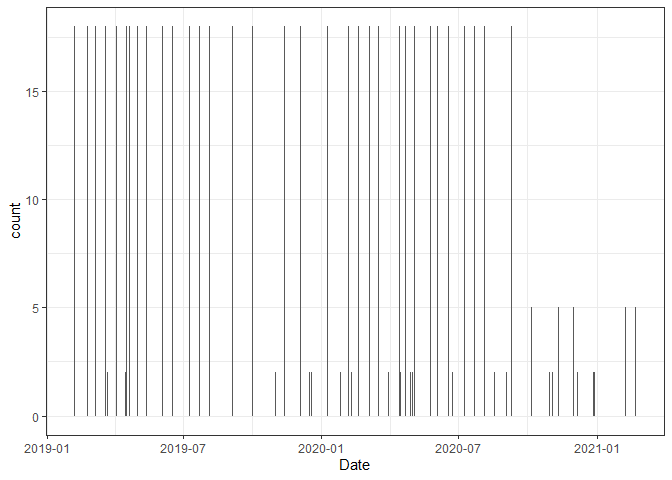

water\_lab\_1
================

Code and data available at: <https://github.com/sal2222/env_chem>

## Read-in data

Source: USGS Water Quality Portal: <https://www.waterqualitydata.us/>

Site ID: USGS-01646580 Date Range: 01-01-2019 to 03-05-2021

Query:
<https://www.waterqualitydata.us/portal/#siteid=USGS-01646580&characteristicName=Bicarbonate&characteristicName=Calcium&characteristicName=Magnesium&characteristicName=Sodium&characteristicName=Potassium&characteristicName=Hardness%2C%20Ca%2C%20Mg&characteristicName=Alkalinity&characteristicName=pH&characteristicName=Total%20dissolved%20solids&characteristicName=Temperature%2C%20water&characteristicName=Chloride&characteristicName=Sulfate&characteristicName=Carbon%20dioxide&startDateLo=01-01-2019&startDateHi=03-05-2021&mimeType=csv>

``` r
potomac <- read_csv("data/result_modified.csv") %>% 
  mutate(Date = as.Date(Date, "%m/%d/%Y"))
```

    ## 
    ## -- Column specification --------------------------------------------------------
    ## cols(
    ##   ID = col_character(),
    ##   Date = col_character(),
    ##   Location_ID = col_character(),
    ##   Hydrologic = col_character(),
    ##   Parameter = col_character(),
    ##   Fraction = col_character(),
    ##   Value = col_double(),
    ##   Units = col_character(),
    ##   Method_name = col_character(),
    ##   Method_source = col_character()
    ## )

## Inspect Data

``` r
# Bar chart of # of parameters analyzed by date

potomac %>% 
  ggplot(aes(x = Date)) +
    geom_bar(stat = "count") +
  theme_bw()
```

<!-- -->

``` r
# Summary table of parameter values

potomac %>% 
  group_by(Parameter) %>% 
    summarise(mean = round(mean(Value), digits = 2),
              sd = round(sd(Value), digits = 2),
              upper95 = round(quantile(Value, .95), digits = 2),
              n = n()) %>% 
  knitr::kable()
```

    ## `summarise()` ungrouping output (override with `.groups` argument)

| Parameter              |    mean |      sd | upper95 |   n |
|:-----------------------|--------:|--------:|--------:|----:|
| Alkalinity             |   91.30 |   17.81 |  118.50 |  71 |
| Bicarbonate            |  109.37 |   21.21 |  139.30 |  38 |
| Calcium                |   34.18 |    6.05 |   42.96 |  33 |
| Carbon dioxide         |    1.70 |    0.85 |    3.20 |  38 |
| Chloride               |   16.88 |    5.33 |   25.02 |  33 |
| Hardness, Ca, Mg       |  120.73 |   23.83 |  159.60 |  33 |
| Magnesium              |    8.53 |    2.30 |   12.36 |  33 |
| pH                     |    8.09 |    0.24 |    8.40 |  90 |
| Potassium              |    2.32 |    0.58 |    3.30 |  33 |
| Sodium                 |    9.94 |    2.29 |   13.76 |  33 |
| Sulfate                |   24.05 |    6.30 |   36.22 |  33 |
| Temperature, water     |   14.52 |    8.72 |   29.10 |  57 |
| Total dissolved solids | 1688.75 | 4003.64 | 8047.00 | 132 |

## Plots

``` r
# Plots of Parameter Values

# Cations and Anions

potomac %>% 
  filter(!Parameter %in% c("Total dissolved solids",
                           "Temperature, water", "pH", "Hardness, Ca, Mg",
                           "Alkalinity")) %>% 
  ggplot(aes(x = Parameter, y = Value)) +
    geom_boxplot() +
    coord_flip() +
    ylab("mg/L") +
    ggtitle("Ions") +
    theme_bw()
```

<!-- -->

``` r
potomac %>% 
  filter(!Parameter %in% c("Total dissolved solids",
                           "Temperature, water", "pH", "Hardness, Ca, Mg",
                           "Alkalinity")) %>% 
  ggplot(aes(x = Date, y = Value, color = Parameter)) +
    geom_point() +
    geom_line() +
    ylab("mg/L") +
    ggtitle("Potomac River Ions") +
    theme_bw()
```

<!-- -->

``` r
# Hardness and Alkalinity
potomac %>% 
  filter(Parameter %in% c("Hardness, Ca, Mg", "Alkalinity")) %>% 
  ggplot(aes(x = Parameter, y = Value)) +
    geom_boxplot() +
    coord_flip() +
    ylab(expression("mg/L as CaCO"[3])) +
    ggtitle("Hardness and Alkalinity") +
    theme_bw()
```

<!-- -->

``` r
potomac %>% 
  filter(Parameter %in% c("Hardness, Ca, Mg", "Alkalinity")) %>% 
   ggplot(aes(x = Date, y = Value, color = Parameter)) +
      geom_point() +
      geom_line() +
      ylab(expression("mg/L as CaCO"[3])) +
      ggtitle("Potomac River Hardness and Alkalinity") +
      theme_bw()
```

<!-- -->

``` r
# pH

potomac %>% 
  filter(Parameter %in% "pH") %>% 
  ggplot(aes(x = Parameter, y = Value)) +
    geom_boxplot() +
    coord_flip() +
    ylab("pH") +
    ggtitle("pH") +
    theme_bw()
```

<!-- -->

## Select data

Filter most recent results with full set of parameter results

``` r
potomac %>% 
  group_by(Date) %>%
    count() %>% 
    arrange(desc(Date)) 
```

    ## # A tibble: 57 x 2
    ## # Groups:   Date [57]
    ##    Date           n
    ##    <date>     <int>
    ##  1 2021-02-22     5
    ##  2 2021-02-08     5
    ##  3 2020-12-30     2
    ##  4 2020-12-28     2
    ##  5 2020-12-07     2
    ##  6 2020-12-01     5
    ##  7 2020-11-12     5
    ##  8 2020-11-03     2
    ##  9 2020-10-30     2
    ## 10 2020-10-06     5
    ## # ... with 47 more rows

2020-09-10: most recent sample day with 18 parameters

``` r
potomac %>% 
  filter(Date == "2020-09-10")
```

    ## # A tibble: 18 x 10
    ##    ID    Date       Location_ID Hydrologic Parameter Fraction   Value Units
    ##    <chr> <date>     <chr>       <chr>      <chr>     <chr>      <dbl> <chr>
    ##  1 nwis~ 2020-09-10 USGS-01646~ Falling s~ Temperat~ <NA>       25.5  deg C
    ##  2 nwis~ 2020-09-10 USGS-01646~ Falling s~ pH        Total       8.2  std ~
    ##  3 nwis~ 2020-09-10 USGS-01646~ Falling s~ pH        Total       8.2  std ~
    ##  4 nwis~ 2020-09-10 USGS-01646~ Falling s~ Carbon d~ Total       1.2  mg/l 
    ##  5 nwis~ 2020-09-10 USGS-01646~ Falling s~ Bicarbon~ Dissolv~  115    mg/l 
    ##  6 nwis~ 2020-09-10 USGS-01646~ Falling s~ Hardness~ <NA>      125    mg/l~
    ##  7 nwis~ 2020-09-10 USGS-01646~ Falling s~ Calcium   Dissolv~   35.5  mg/l 
    ##  8 nwis~ 2020-09-10 USGS-01646~ Falling s~ Magnesium Dissolv~    8.72 mg/l 
    ##  9 nwis~ 2020-09-10 USGS-01646~ Falling s~ Sodium    Dissolv~    8.92 mg/l 
    ## 10 nwis~ 2020-09-10 USGS-01646~ Falling s~ Potassium Dissolv~    2.69 mg/l 
    ## 11 nwis~ 2020-09-10 USGS-01646~ Falling s~ Chloride  Dissolv~   14.3  mg/l 
    ## 12 nwis~ 2020-09-10 USGS-01646~ Falling s~ Sulfate   Dissolv~   28.4  mg/l 
    ## 13 nwis~ 2020-09-10 USGS-01646~ Falling s~ Alkalini~ Dissolv~   96.5  mg/l~
    ## 14 nwis~ 2020-09-10 USGS-01646~ Falling s~ Alkalini~ Dissolv~   95.3  mg/l~
    ## 15 nwis~ 2020-09-10 USGS-01646~ Falling s~ Total di~ Dissolv~  168    mg/l 
    ## 16 nwis~ 2020-09-10 USGS-01646~ Falling s~ Total di~ Dissolv~  166    mg/l 
    ## 17 nwis~ 2020-09-10 USGS-01646~ Falling s~ Total di~ Dissolv~ 2510    tons~
    ## 18 nwis~ 2020-09-10 USGS-01646~ Falling s~ Total di~ Dissolv~    0.23 tons~
    ## # ... with 2 more variables: Method_name <chr>, Method_source <chr>

``` r
potomac %>% 
  filter(Date == "2020-09-10") %>% 
  dplyr::select(Parameter, Value, Units) %>% 
  knitr::kable()
```

| Parameter              |   Value | Units      |
|:-----------------------|--------:|:-----------|
| Temperature, water     |   25.50 | deg C      |
| pH                     |    8.20 | std units  |
| pH                     |    8.20 | std units  |
| Carbon dioxide         |    1.20 | mg/l       |
| Bicarbonate            |  115.00 | mg/l       |
| Hardness, Ca, Mg       |  125.00 | mg/l CaCO3 |
| Calcium                |   35.50 | mg/l       |
| Magnesium              |    8.72 | mg/l       |
| Sodium                 |    8.92 | mg/l       |
| Potassium              |    2.69 | mg/l       |
| Chloride               |   14.30 | mg/l       |
| Sulfate                |   28.40 | mg/l       |
| Alkalinity             |   96.50 | mg/l CaCO3 |
| Alkalinity             |   95.30 | mg/l CaCO3 |
| Total dissolved solids |  168.00 | mg/l       |
| Total dissolved solids |  166.00 | mg/l       |
| Total dissolved solids | 2510.00 | tons/day   |
| Total dissolved solids |    0.23 | tons/ac ft |
